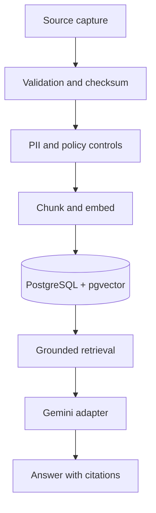

# Continuum Private AI Workspace

A working portfolio demo for a private Gemini-ready knowledge workspace. It demonstrates the risk controls and product architecture discussed for Richard's later phases without using client data or requiring paid services.

## What works

- Interactive Command Center following the Builder's Desk spine
- Grounded retrieval against synthetic authoritative records
- Source scores and traceability on every answer
- Ingestion pipeline simulation with checksum, policy, and vector stages
- Data Registry with integrity state, hashes, chunks, and tags
- Workspace modules for Android capture and live multimedia routing
- Integration adapter view for Gemini, PostgreSQL/pgvector, and object storage
- System Health audit timeline
- Responsive desktop and mobile UI
- Automated retrieval tests and production build validation

## Run locally

```bash
npm install
npm run dev
```

Open `http://localhost:4173`.

## Validate

```bash
npm run check
```

## Architecture



Original records are immutable and authoritative. AI summaries are derivatives with version and source references, preventing context drift from summary-of-summary chains.

## Production path

1. Replace `src/data.ts` with repository-backed service calls.
2. Implement the retrieval contract with PostgreSQL and pgvector.
3. Add a server-side Gemini adapter; never expose model credentials to the browser.
4. Add OIDC authentication, row-level tenant policies, encryption, retention, and audit exports.
5. Add resumable CameraX media uploads for Phase 2.
6. Add WebRTC or segmented live-upload routing with operator escalation for Phase 3.

## Privacy

The repository contains synthetic demo content only. Uploaded personal records and client documents are explicitly excluded.
